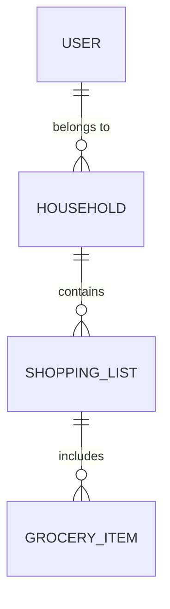

# Architecture - Home Manager

## 1. Architectural Overview

Home Manager is implemented as a full‑stack Next.js application using the App Router. The project targets a Progressive Web App that must remain usable offline and provide live updates between a small set of household members. The chosen stack is:

- **Next.js (App Router)** executing both UI and server logic in the same repository.
- **API Routes** for serverless HTTP endpoints hosted on Vercel.
- **PostgreSQL serverless (Supabase)** providing the primary data store plus a realtime layer.
- **Prisma ORM** for typed access and schema migrations.
- **Tailwind CSS** for utility‑first styling.
- **Authentication via Clerk** (free tier covers the two early users).
- **Manifest.json and Service Worker** written by hand to satisfy PWA requirements.
- **Deployment on Vercel** with automatic building, edge caching and serverless functions.

The architecture delegates responsibilities as follows:

- **Presentation**: React components rendered on the client and server; styling and interaction handled in the browser.
- **Application / API**: Next.js API Routes perform validation, authorization and coordinate data operations via Prisma.
- **Persistence & Events**: Supabase hosts Postgres tables; realtime events are emitted on row changes.
- **Offline storage**: IndexedDB holds a local copy of the user’s lists and an operation queue.

The overall goal is pragmatic: provide working MVP in weeks, avoid unnecessary complexity, but leave clear boundaries so that components can be replaced or scaled independently.

## 2. System Components

### 2.1 Frontend

The client is a standard Next.js app with pages and components under `app/`. Server‑side rendering is used for the initial household and list fetch; thereafter the client operates on cached state and syncs changes when online.

```
Frontend (Next.js)
├─ app/
│  ├─ page.tsx          # route components
│  ├─ components/
│  └─ hooks/
├─ public/
│  ├─ manifest.json
│  └─ sw.js             # service worker
└─ styles/              # Tailwind config
```

**Local storage layer**: an IndexedDB database (`home_manager`) with object stores `shopping_lists`, `grocery_items` and `ops_queue`.

### 2.2 Backend

Next.js API Routes are simple functions exported from files in `app/api/`. Each route is deployed as a serverless function; cold starts are acceptable given light traffic.

```
app/api/
├─ auth/
│  ├─ login/route.ts
│  └─ register/route.ts
├─ lists/
│  ├─ route.ts        # GET, POST
│  └─ [id]/route.ts   # PUT, DELETE
└─ items/
   ├─ route.ts        # POST
   └─ [id]/complete/route.ts
```

Routes interact with Prisma client instances connected to the Supabase Postgres. Clerk middleware validates JWTs and injects `req.user`.

### 2.3 Database & Realtime

Supabase provides the PostgreSQL database and a builtin realtime API. Tables mirror the domain model; a trigger on `grocery_items` and `shopping_lists` publishes changes to connected clients.



Realtime subscriptions are managed client‑side via the Supabase JS SDK.

## 3. Data Flow

### 3.1 Authentication

1. Client POSTs credentials to `/api/auth/login`.
2. API Route verifies via Clerk; receives a session token.
3. Token is stored in an httpOnly cookie; Next.js middleware reads it on each SSR request.
4. User identity and `householdId` are available to subsequent API calls.

### 3.2 CRUD operations

```
Client UI -> IndexedDB (write)
                   ↓
             Ops queue append
                   ↓ [online]
           /api/lists or /api/items
                   ↓
           Supabase (Prisma) write
                   ↓
       Supabase realtime event -> clients
                   ↓
         Client merges into IndexedDB
```

On startup the client performs a `GET /api/lists` and hydrates IndexedDB; subsequent interactions read from the local database.

### 3.3 Conflict handling

Every upsert request includes a `version` timestamp taken from the local row. The server compares it against the current value; if the server record is newer the request is rejected with `409` and the offending user receives a push notification (via Supabase Edge Function) informing them that their change was discarded. This implements the “first write wins” requirement.

## 4. Domain Boundaries

The domain is partitioned into the following bounded contexts:

- **Authentication**: managed by Clerk; all identity logic resides outside the application.
- **Household management**: creating and inviting users to a household; enforced by middleware.
- **Shopping lists**: CRUD on lists and items. Each list and item carries a `householdId` FK.
- **Sync & Offline**: local IndexedDB and the operation queue represent a separate context that only interacts with the core model via well‑defined APIs (`syncChanges` function).

Boundaries are kept thin: serverless functions do not import offline logic, and the UI layer treats IndexedDB as a cache; the API is the sole source of truth.

## 5. Data Consistency Strategy

- **Server**: strong consistency. All writes occur within Postgres transactions. Prisma serializes operations; unique constraints enforce invariants (e.g., an item references a valid list).
- **Client**: eventual consistency. The local cache may lag; the sync process ensures eventual convergence.
- **Conflict resolution**: timestamp‑based, first‑write‑wins. The client retains the discarded operation in a log for debugging and notifies the user.

Concurrency is handled at the API level through optimistic locking (version field) and unique DB constraints. Given the small user count per household, contention is expected to be low.

## 6. Offline & PWA Strategy

- **Storage engine**: IndexedDB is used because it scales to megabytes, supports transactions and queries, and does not block the main thread.
- **Service worker**: a basic SW intercepts fetch requests. Static assets are cached on install; requests to `/api/*` are passed through but queued when offline.

```javascript
// sw.js
self.addEventListener('fetch', event => {
  if (event.request.url.includes('/api/')) {
    event.respondWith(networkOrQueue(event.request));
  }
});
```

- **Sync process**: when the app detects `navigator.onLine === true`, it drains `ops_queue` by sending batched changes to `/api/sync`. The API returns updated versions which are merged into IndexedDB.
- **Push notifications**: Supabase Edge Functions send push messages to the user whose change was rejected; the SW displays them.

## 7. Scalability Considerations

The chosen stack is inherently serverless, allowing horizontal scaling with near‑zero operational overhead.

- **Frontend**: hosted on Vercel’s CDN; assets cached globally.
- **API**: each route is a stateless Lambda. Cold starts are mitigated by keeping the Prisma client connection warm and by using syscalls sparingly.
- **Database**: Supabase scales the Postgres instance automatically; the workload is small (one or two households). Partitioning by `householdId` is a later concern.
- **Realtime**: Supabase Realtime handles WebSocket connections; usage is minimal so the free tier suffices initially.

Future scaling steps include adding read replicas, introducing Redis cache (via Supabase new caching layer), and offloading heavy computation to edge functions.

## 8. Trade‑offs & Limitations

- **Serverless WebSockets**: by using Supabase Realtime we avoid managing socket servers, but we accept the vendor lock‑in and limited event transformation.
- **Clerk dependency**: simplifies auth but ties us to a proprietary API and pricing. However, the free tier handles the two users, and migrating away is feasible (Clerk exports user data).
- **IndexedDB complexity**: code to manage the local database is nontrivial, but it is necessary for the offline requirement. The alternative (localStorage) cannot sustain large lists.
- **Operational complexity**: serverless functions make debugging harder (cold starts, lack of persistent logs), but for an MVP the benefit of zero‑ops outweighs this.
- **Data size**: Supabase free tier has storage limits; heavy usage of attachments (not in MVP) would require external storage.

## 9. Future Evolution Path

1. **Phase 1**: MVP as described.
2. **Phase 1.5**: add polling fallback or use Supabase Realtime more aggressively; refine conflict notifications.
3. **Phase 2**: extend domain with tasks, notes, reminders; introduce user roles beyond admin/member; add push notifications formally.
4. **Phase 3**: evaluate migration of auth to NextAuth if lock‑in becomes a concern; add edge caching for selective API routes.
5. **Phase 4**: prepare for high‑volume households by sharding Postgres or migrating to a distributed SQL engine; add application‑level caching and background workers (Supabase Functions).

Each stage maintains the same bounded contexts and data model; new features plug into the existing API routes, and offline logic is reusable.


