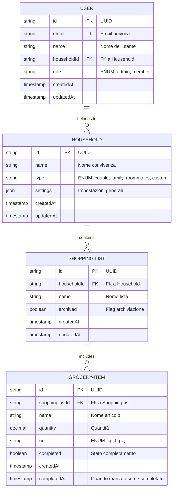

# Domain Model - Home Manager

## Panoramica

Home Manager è una Progressive Web App progettata per gestire la vita domestica condivisa in una convivenza. Il modello dati supporta la gestione di liste della spesa, con possibilità di future estensioni per task, note e reminder.

---

## Diagramma ER (Entity-Relationship)



---

## Definizione Entità e Campi

### User (Utente)

| Campo | Tipo | Vincoli | Descrizione |
|-------|------|---------|-------------|
| id | UUID (PK) | NOT NULL, UNIQUE | Identificatore univoco |
| email | String | NOT NULL, UNIQUE | Email dell'utente (login) |
| name | String | NOT NULL | Nome visualizzato |
| householdId | UUID (FK) | NOT NULL | Riferimento a Household |
| role | ENUM | DEFAULT 'member' | Ruolo: `admin`, `member` |
| createdAt | Timestamp | NOT NULL, AUTO | Data creazione |
| updatedAt | Timestamp | NOT NULL, AUTO | Ultimo aggiornamento |

**Note:**
- `email` deve essere univoca a livello globale
- `role` determina i permessi: admin può aggiungere/rimuovere utenti, member no
- Un utente può appartenere a un solo Household

### Household (Convivenza)

| Campo | Tipo | Vincoli | Descrizione |
|-------|------|---------|-------------|
| id | UUID (PK) | NOT NULL, UNIQUE | Identificatore univoco |
| name | String | NOT NULL | Nome del gruppo (es. "Casa Milano") |
| type | ENUM | NOT NULL | Tipo: `couple`, `family`, `roommates`, `custom` |
| settings | JSON | DEFAULT {} | Impostazioni generali (notifiche, valute, preferenze) |
| createdAt | Timestamp | NOT NULL, AUTO | Data creazione |
| updatedAt | Timestamp | NOT NULL, AUTO | Ultimo aggiornamento |

**Note:**
- Il `type` è orientativo per personalizzazione futura (es. template diversi)
- `settings` contiene configurazioni serializzate (es. `{"currency": "EUR", "language": "it"}`)
- Un Household rappresenta un gruppo di conviventi

### ShoppingList (Lista della Spesa)

| Campo | Tipo | Vincoli | Descrizione |
|-------|------|---------|-------------|
| id | UUID (PK) | NOT NULL, UNIQUE | Identificatore univoco |
| householdId | UUID (FK) | NOT NULL | Riferimento a Household |
| name | String | NOT NULL | Nome lista (es. "Spesa settimanale") |
| archived | Boolean | DEFAULT false | Flag archiviazione |
| createdAt | Timestamp | NOT NULL, AUTO | Data creazione |
| updatedAt | Timestamp | NOT NULL, AUTO | Ultimo aggiornamento |

**Note:**
- Una ShoppingList appartiene a un solo Household
- `archived` permette di conservare liste storiche senza eliminarle
- Il nome può essere data-based (es. "Spesa Feb 2026") o topic-based (es. "Verdure")

### GroceryItem (Articolo della Spesa)

| Campo | Tipo | Vincoli | Descrizione |
|-------|------|---------|-------------|
| id | UUID (PK) | NOT NULL, UNIQUE | Identificatore univoco |
| shoppingListId | UUID (FK) | NOT NULL | Riferimento a ShoppingList |
| name | String | NOT NULL | Nome articolo (es. "Latte intero 1L") |
| quantity | Decimal | DEFAULT 1.0 | Quantità |
| unit | ENUM | DEFAULT 'pz' | Unità: `kg`, `l`, `pz`, `g`, `ml`, `pack` |
| completed | Boolean | DEFAULT false | Se acquistato/completato |
| createdAt | Timestamp | NOT NULL, AUTO | Data creazione |
| completedAt | Timestamp | NULLABLE | Quando marcato come completato |

**Note:**
- Un GroceryItem appartiene a una sola ShoppingList
- La combinazione `quantity + unit` fornisce contesto completo (es. "2 kg di mele")
- `completedAt` è automaticamente impostato quando `completed` passa a true
- Gli item completati rimangono nella lista per tracciamento (non eliminati)

---

## Invarianti e Regole di Integrità

### Vincoli di Integrità Referenziale

1. **User ↔ Household**: Ogni User deve riferire un Household valido
   - Eliminazione Household: cascata → Disattiva o migra users (TBD)
   - Elimina un User non invalida il Household

2. **ShoppingList ↔ Household**: Ogni lista deve appartenere a un Household valido
   - Eliminazione Household: cascata → Elimina liste associate

3. **GroceryItem ↔ ShoppingList**: Ogni item deve appartenere a una lista valida
   - Eliminazione ShoppingList: cascata → Elimina items associati

### Regole di Autorizzazione

1. **User nel Household**: Solo utenti appartenenti a un Household possono modificare liste e item
2. **Admin vs Member**:
   - **Admin**: Gestione completa di utenti, liste, item
   - **Member**: Gestione oppure only lettura items. Consenta creare/modificare/completare item ma non eliminarli
3. **Soft Delete**: Les liste e gli item non vengono mai eliminate permanentemente, ma marcate come `archived` o `deleted` (tramite soft delete timestamp se necessario)

### Regole di Business

1. **Unicità Email**: Nessun duplicato email a livello di sistema
2. **Unicità Household per User**: Un user può appartenere a un solo Household (estensioni future potrebbero permettere multiple affiliazioni)
3. **Quantità Positiva**: La quantità di un item deve essere > 0
4. **Validazione Unit**: L'unità deve essere nella lista predefinita
5. **Single Household Owner**: Almeno un admin deve esistere per Household (gestito a livello di business logic)

---

## Estensioni Future

### Fase 2: Task Management

Aggiungere entità `Task` e `TaskList`:

```
TASK-LIST {
    id (UUID, PK)
    householdId (UUID, FK)
    name (String)
    createdAt
    updatedAt
}

TASK {
    id (UUID, PK)
    taskListId (UUID, FK)
    title (String)
    description (Text, nullable)
    assignedTo (UUID, FK → User, nullable)
    dueDate (Date, nullable)
    priority (ENUM: low, medium, high)
    completed (Boolean)
    createdAt
    updatedAt
}
```

**Relazioni**: Household → TaskList → Task

### Fase 3: Note e Memo

Aggiungere entità `Note`:

```
NOTE {
    id (UUID, PK)
    householdId (UUID, FK)
    title (String)
    content (Text)
    createdBy (UUID, FK → User)
    tags (JSON Array)
    pinned (Boolean)
    createdAt
    updatedAt
}
```

### Fase 4: Reminder e Notifiche

Aggiungere entità `Reminder`:

```
REMINDER {
    id (UUID, PK)
    householdId (UUID, FK)
    title (String)
    description (Text)
    scheduledFor (Timestamp)
    frequency (ENUM: once, daily, weekly, monthly)
    notificationChannels (JSON Array: email, push, sms)
    active (Boolean)
    createdAt
}
```

---

## Considerazioni Architetturali

### Partizione dei Dati

- **Per Household**: Tutte le liste e i task appartengono a un Household, facilitando isolamento dati multi-tenant
- **Scalabilità**: Possibile implementare sharding per Household su database distribuito

### Audit e Compliance

- **Timestamps**: `createdAt` e `updatedAt` per tracciamento completo
- **Soft Delete**: Items e liste non eliminati ma marcati come archived
- **User Tracking**: Futuro: aggiungere `createdBy`, `updatedBy` per audit trail

### Performance

- **Indici Suggeriti**:
  - `User.email` (UNIQUE)
  - `User.householdId` (FK)
  - `ShoppingList.householdId` (FK)
  - `GroceryItem.shoppingListId` (FK)
  - `GroceryItem.completed` (per query rapide su item non completati)

- **Denormalizzazione (Futura)**:
  - Cache del count items completati in ShoppingList
  - Cache dell'ultimo aggiornamento per sincronizzazione real-time

### Sincronizzazione PWA

- **Offline First**: Supportare CouchDB o IndexedDB per sincronizzazione offline
- **Conflict Resolution**: Timestamp-based merge per conflitti di modifica concorrente
- **Change Feed**: Tracciare versioni per delta sync

---

## Diagramma Relazionale Fisica (pseudo-SQL)

```sql
CREATE TABLE households (
    id VARCHAR(36) PRIMARY KEY,
    name VARCHAR(255) NOT NULL,
    type ENUM('couple', 'family', 'roommates', 'custom') NOT NULL,
    settings JSON DEFAULT '{}',
    created_at TIMESTAMP DEFAULT CURRENT_TIMESTAMP,
    updated_at TIMESTAMP DEFAULT CURRENT_TIMESTAMP ON UPDATE CURRENT_TIMESTAMP,
    UNIQUE KEY unique_name_per_user (id)
);

CREATE TABLE users (
    id VARCHAR(36) PRIMARY KEY,
    email VARCHAR(255) NOT NULL UNIQUE,
    name VARCHAR(255) NOT NULL,
    household_id VARCHAR(36) NOT NULL,
    role ENUM('admin', 'member') DEFAULT 'member',
    created_at TIMESTAMP DEFAULT CURRENT_TIMESTAMP,
    updated_at TIMESTAMP DEFAULT CURRENT_TIMESTAMP ON UPDATE CURRENT_TIMESTAMP,
    FOREIGN KEY (household_id) REFERENCES households(id),
    INDEX idx_household_id (household_id)
);

CREATE TABLE shopping_lists (
    id VARCHAR(36) PRIMARY KEY,
    household_id VARCHAR(36) NOT NULL,
    name VARCHAR(255) NOT NULL,
    archived BOOLEAN DEFAULT FALSE,
    created_at TIMESTAMP DEFAULT CURRENT_TIMESTAMP,
    updated_at TIMESTAMP DEFAULT CURRENT_TIMESTAMP ON UPDATE CURRENT_TIMESTAMP,
    FOREIGN KEY (household_id) REFERENCES households(id),
    INDEX idx_household_id (household_id),
    INDEX idx_archived (archived)
);

CREATE TABLE grocery_items (
    id VARCHAR(36) PRIMARY KEY,
    shopping_list_id VARCHAR(36) NOT NULL,
    name VARCHAR(255) NOT NULL,
    quantity DECIMAL(10, 2) DEFAULT 1.0,
    unit ENUM('kg', 'l', 'pz', 'g', 'ml', 'pack') DEFAULT 'pz',
    completed BOOLEAN DEFAULT FALSE,
    created_at TIMESTAMP DEFAULT CURRENT_TIMESTAMP,
    completed_at TIMESTAMP NULL,
    FOREIGN KEY (shopping_list_id) REFERENCES shopping_lists(id),
    INDEX idx_shopping_list_id (shopping_list_id),
    INDEX idx_completed (completed)
);
```

---

## Mappatura a Tecnologie PWA

### Backend Suggerito
- **Database**: MySQL/PostgreSQL (relazionale) oppure Firebase/MongoDB (NoSQL)
- **API**: RESTful o GraphQL
- **Auth**: JWT con refresh tokens
- **Real-time**: WebSocket per sincronizzazione live tra dispositivi

### Frontend Suggerito
- **Storage Offline**: IndexedDB (built-in browser) o Realm Web
- **Sync**: Background Sync API o Periodic Sync API
- **State Management**: Redux, Zustand, o Tanstack Query

### Infrastructure
- **Hosting**: Vercel, Netlify, o AWS S3 + CloudFront
- **CDN**: Per asset statici
- **Monitoraggio**: Sentry per error tracking
