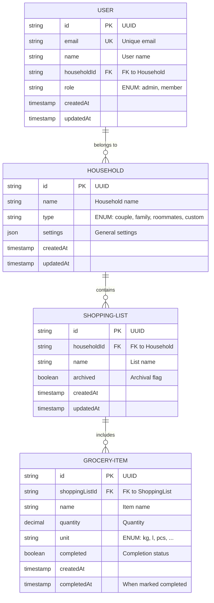

# Domain Model - Home Manager

## Overview

Home Manager is a Progressive Web App designed to manage shared domestic life within a household. The data model supports shopping list management and is extensible for future tasks, notes and reminders.

---

## ER Diagram (Entity-Relationship)



---

## Entity and Field Definitions

### User

| Field | Type | Constraints | Description |
|-------|------|-------------|-------------|
| id | UUID (PK) | NOT NULL, UNIQUE | Unique identifier |
| email | String | NOT NULL, UNIQUE | User's email (login) |
| name | String | NOT NULL | Display name |
| householdId | UUID (FK) | NOT NULL | Reference to Household |
| createdAt | Timestamp | NOT NULL, AUTO | Creation timestamp |
| updatedAt | Timestamp | NOT NULL, AUTO | Last update timestamp |

**Notes:**
- The `email` value must be globally unique.
- A user may belong to only one household.

### Household

| Field | Type | Constraints | Description |
|-------|------|-------------|-------------|
| id | UUID (PK) | NOT NULL, UNIQUE | Unique identifier |
| name | String | NOT NULL | Group name (e.g. "Milan House") |
| settings | JSON | DEFAULT {} | General settings (notifications, currency, preferences) |
| createdAt | Timestamp | NOT NULL, AUTO | Creation timestamp |
| updatedAt | Timestamp | NOT NULL, AUTO | Last update timestamp |

**Notes:**
- A Household represents a cohabiting group.

### ShoppingList

| Field | Type | Constraints | Description |
|-------|------|-------------|-------------|
| id | UUID (PK) | NOT NULL, UNIQUE | Unique identifier |
| householdId | UUID (FK) | NOT NULL | Reference to Household |
| name | String | NOT NULL | List name (e.g. "Weekly Groceries") |
| archived | Boolean | DEFAULT false | Archival flag |
| createdAt | Timestamp | NOT NULL, AUTO | Creation timestamp |
| updatedAt | Timestamp | NOT NULL, AUTO | Last update timestamp |

**Notes:**
- Each ShoppingList belongs to a single Household.
- `archived` allows keeping historical lists without deleting them.
- Name may be date-based ("Feb 2026 groceries") or topic-based ("Vegetables").

### GroceryItem

| Field | Type | Constraints | Description |
|-------|------|-------------|-------------|
| id | UUID (PK) | NOT NULL, UNIQUE | Unique identifier |
| shoppingListId | UUID (FK) | NOT NULL | Reference to ShoppingList |
| name | String | NOT NULL | Item name (e.g. "Whole milk 1L") |
| quantity | Decimal | DEFAULT 1.0 | Quantity |
| unit | ENUM | DEFAULT 'pz' | Unit: `kg`, `l`, `pcs`, `g`, `ml`, `pack` |
| completed | Boolean | DEFAULT false | Whether purchased/completed |
| createdAt | Timestamp | NOT NULL, AUTO | Creation timestamp |
| completedAt | Timestamp | NULLABLE | When marked completed |

**Notes:**
- A GroceryItem belongs to a single ShoppingList.
- The `quantity + unit` pair provides full context (e.g. "2 kg of apples").
- `completedAt` is set automatically when `completed` becomes true.
- Completed items remain in the list for tracking (not removed).

---

## Invariants and Integrity Rules

### Referential Integrity Constraints

1. **User ↔ Household**: every User must reference a valid Household.
   - Deleting a Household cascades: users are disabled or migrated (TBD).
   - Deleting a User does not invalidate the Household.

2. **ShoppingList ↔ Household**: every list must belong to a valid Household.
   - Deleting a Household cascades: associated lists are deleted.

3. **GroceryItem ↔ ShoppingList**: every item must belong to a valid list.
   - Deleting a ShoppingList cascades: associated items are deleted.

### Authorization Rules

1. **User in Household**: only users belonging to a Household can modify that household's lists and items.
2. **Admin vs Member**:
   - **Admin**: full management of users, lists, items.
   - **Member**: can create/modify/complete items but not delete them.
3. **Soft Delete**: lists and items are never permanently removed; they are marked `archived` or `deleted` (via a timestamp) instead.

### Business Rules

1. **Email Uniqueness**: no duplicate emails in the system.
2. **Single Household per User**: one household per user (future versions may allow multiple memberships).
3. **Positive Quantity**: item quantity must be > 0.
4. **Unit Validation**: unit value must come from predefined list.
5. **Household Admin Required**: at least one admin must exist per household (enforced in business logic).

---

## Future Extensions

### Phase 2: Task Management

Add entities `Task` and `TaskList`:

```
TASK-LIST {
    id (UUID, PK)
    householdId (UUID, FK)
    name (String)
    createdAt
    updatedAt
}

TASK {
    id (UUID, PK)
    taskListId (UUID, FK)
    title (String)
    description (Text, nullable)
    assignedTo (UUID, FK → User, nullable)
    dueDate (Date, nullable)
    priority (ENUM: low, medium, high)
    completed (Boolean)
    createdAt
    updatedAt
}
```

**Relationships**: Household → TaskList → Task

### Phase 3: Notes and Memos

Add `Note` entity:

```
NOTE {
    id (UUID, PK)
    householdId (UUID, FK)
    title (String)
    content (Text)
    createdBy (UUID, FK → User)
    tags (JSON Array)
    pinned (Boolean)
    createdAt
    updatedAt
}
```

### Phase 4: Reminders and Notifications

Add `Reminder` entity:

```
REMINDER {
    id (UUID, PK)
    householdId (UUID, FK)
    title (String)
    description (Text)
    scheduledFor (Timestamp)
    frequency (ENUM: once, daily, weekly, monthly)
    notificationChannels (JSON Array: email, push, sms)
    active (Boolean)
    createdAt
}
```

---

## Architectural Considerations

### Data Partitioning

- **By Household**: all lists and tasks belong to a Household, enabling multi‑tenant isolation.
- **Scalability**: sharding by householdId is a possible future step in a distributed database.

### Audit and Compliance

- **Timestamps**: `createdAt` and `updatedAt` for full change tracking.
- **Soft Delete**: items and lists marked archived rather than removed.
- **User Tracking**: future addition of `createdBy`, `updatedBy` for audit trails.

### Performance

- **Suggested Indexes**:
  - `User.email` (UNIQUE)
  - `User.householdId` (FK)
  - `ShoppingList.householdId` (FK)
  - `GroceryItem.shoppingListId` (FK)
  - `GroceryItem.completed` (for fast queries on incomplete items)

- **Denormalization (Future)**:
  - cache count of completed items in ShoppingList.
  - cache last update timestamp for real‑time sync.

### PWA Synchronization

- **Offline First**: support CouchDB or IndexedDB for offline sync.
- **Conflict Resolution**: timestamp‑based merge for concurrent edits.
- **Change Feed**: track versions for delta sync.

---

## Physical Relational Diagram (pseudo‑SQL)

```sql
CREATE TABLE households (
    id VARCHAR(36) PRIMARY KEY,
    name VARCHAR(255) NOT NULL,
    type ENUM('couple', 'family', 'roommates', 'custom') NOT NULL,
    settings JSON DEFAULT '{}',
    created_at TIMESTAMP DEFAULT CURRENT_TIMESTAMP,
    updated_at TIMESTAMP DEFAULT CURRENT_TIMESTAMP ON UPDATE CURRENT_TIMESTAMP,
    UNIQUE KEY unique_name_per_user (id)
);

CREATE TABLE users (
    id VARCHAR(36) PRIMARY KEY,
    email VARCHAR(255) NOT NULL UNIQUE,
    name VARCHAR(255) NOT NULL,
    household_id VARCHAR(36) NOT NULL,
    role ENUM('admin', 'member') DEFAULT 'member',
    created_at TIMESTAMP DEFAULT CURRENT_TIMESTAMP,
    updated_at TIMESTAMP DEFAULT CURRENT_TIMESTAMP ON UPDATE CURRENT_TIMESTAMP,
    FOREIGN KEY (household_id) REFERENCES households(id),
    INDEX idx_household_id (household_id)
);

CREATE TABLE shopping_lists (
    id VARCHAR(36) PRIMARY KEY,
    household_id VARCHAR(36) NOT NULL,
    name VARCHAR(255) NOT NULL,
    archived BOOLEAN DEFAULT FALSE,
    created_at TIMESTAMP DEFAULT CURRENT_TIMESTAMP,
    updated_at TIMESTAMP DEFAULT CURRENT_TIMESTAMP ON UPDATE CURRENT_TIMESTAMP,
    FOREIGN KEY (household_id) REFERENCES households(id),
    INDEX idx_household_id (household_id),
    INDEX idx_archived (archived)
);

CREATE TABLE grocery_items (
    id VARCHAR(36) PRIMARY KEY,
    shopping_list_id VARCHAR(36) NOT NULL,
    name VARCHAR(255) NOT NULL,
    quantity DECIMAL(10, 2) DEFAULT 1.0,
    unit ENUM('kg', 'l', 'pz', 'g', 'ml', 'pack') DEFAULT 'pz',
    completed BOOLEAN DEFAULT FALSE,
    created_at TIMESTAMP DEFAULT CURRENT_TIMESTAMP,
    completed_at TIMESTAMP NULL,
    FOREIGN KEY (shopping_list_id) REFERENCES shopping_lists(id),
    INDEX idx_shopping_list_id (shopping_list_id),
    INDEX idx_completed (completed)
);
```

