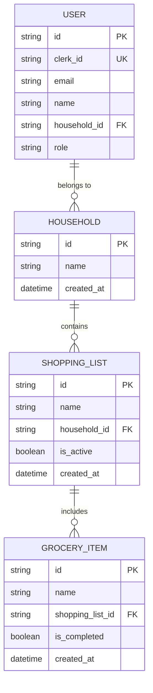

# Domain Model - Home Manager

## Overview
Home Manager manages shared household life, starting with shopping lists.  
The main entities for the MVP are:

- **Household**: group of users living together.  
- **User**: person who is part of a Household.  
- **ShoppingList**: shopping list of a Household.  
- **GroceryItem**: single item within a list.

---

## ER Diagram (simplified)

